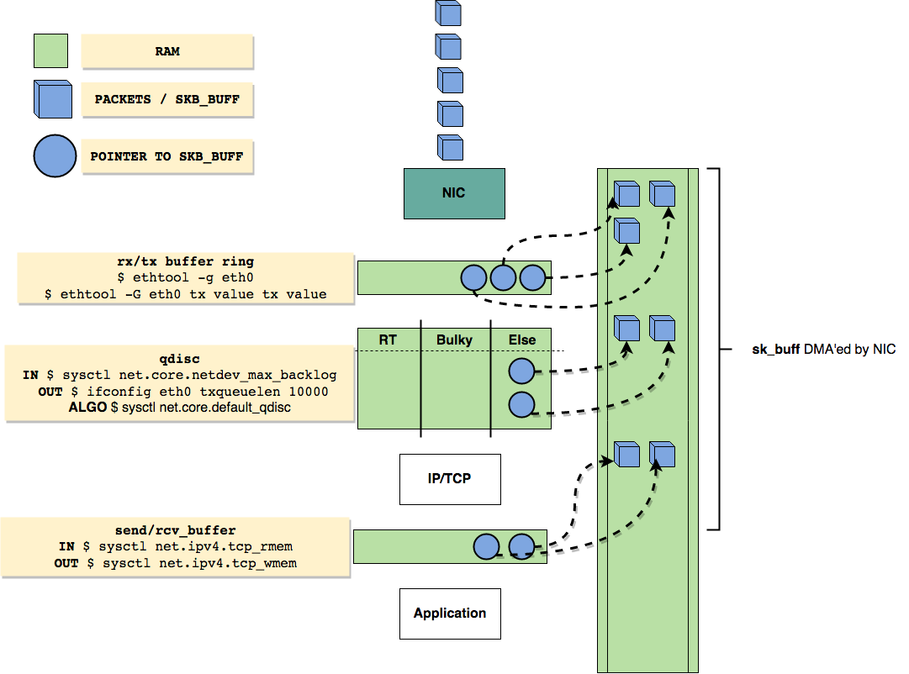

refer:
  https://github.com/leandromoreira/linux-network-performance-parameters

关于linux网络流程的摘抄以及一些notes。

## 1. Linux network queues overview

## 2. Ingress - they're coming

1. Packets arrive at the NIC
2. NIC will verify `MAC` (if not on promiscuous mode) and `FCS` and decide to drop or to continue
3. NIC will [DMA packets at RAM](https://en.wikipedia.org/wiki/Direct_memory_access), in a region previously prepared (mapped) by the driver
4. NIC will enqueue references to the packets at receive [ring buffer](https://en.wikipedia.org/wiki/Circular_buffer) queue `rx` until `rx-usecs` timeout or `rx-frames`
5. NIC will raise a `hard IRQ`
6. CPU will run the `IRQ handler` that runs the driver's code
7. Driver will `schedule a NAPI`, clear the `hard IRQ` and return
8. Driver raise a `soft IRQ (NET_RX_SOFTIRQ)`
    - drivers/net/ethernet/realtek/r8169.c:`rtl8169_interrupt(int irq, void *dev_instance) {... __napi_schedule(napi);}`
    - source/net/core/dev.c:`__napi_schedule() {____napi_schedule()}`
    - source/net/core/dev.c:`____napi_schedule() {_raise_softirq_irqoff(NET_RX_SOFTIRQ);}`
9. NAPI will poll data from the receive ring buffer until `netdev_budget_usecs` timeout or `netdev_budget` and `dev_weight` packets
10. Linux will also allocate memory to `sk_buff`
11. Linux fills the metadata: protocol, interface, setmacheader, removes ethernet
12. Linux will pass the skb to the kernel stack (`netif_receive_skb`)
    - source/net/core/dev.c:`netif_receive_skb(struct sk_buff *skb) { netif_receive_skb_internal(skb); }`
    - source/net/core/dev.c:`netif_receive_skb_internal(struct sk_buff *skb) {  __netif_receive_skb(skb); }`
    - source/net/core/dev.c:`__netif_receive_skb(struct sk_buff *skb) { __netif_receive_skb_one_core(skb, bool); }`
    - source/net/core/dev.c:`__netif_receive_skb_one_core(struct sk_buff *skb, bool *quota) { __netif_receive_skb_core(&skb,...); }`
    - source/net/core/dev.c:`__netif_receive_skb_core(struct sk_buff **pskb,...) { deliver_skb(skb, pt_prev, orig_dev); }`
    - source/net/core/dev.c:``deliver_skb(struct sk_buff *skb, struct sk_buff **pt_prev,...) { pt_prev->func(skb, skb->dev, pt_prev, orig_dev);}` → ip_rcv()
13. It will set the network header, clone `skb` to taps (i.e. tcpdump) and pass it to tc ingress
14. Packets are handled to a qdisc sized `netdev_max_backlog` with its algorithm defined by `default_qdisc`
15. It calls `ip_rcv` and packets are handled to IP
    - source/net/ipv4/ip_input.c:``ip_rcv(struct sk_buff *skb, struct net_device *dev, struct packet_type *pt, ...)`
      + `ip_rcv_core(struct sk_buff *skb, struct net *net);`  → ip main receive routine， header checksum, fragmentation, etc.
      + `NF_HOOK(NFPROTO_IPV4, NF_INET_PRE_ROUTING, net, NULL, skb, dev, NULL,  ip_rcv_finish);`
16. It calls netfilter (`PREROUTING`)
17. It looks at the routing table, if forwarding or local
18. If it's local it calls netfilter (`LOCAL_IN`)
19. It calls the L4 protocol (for instance `tcp_v4_rcv`)
20. It finds the right socket
21. It goes to the tcp finite state machine
22. Enqueue the packet to  the receive buffer and sized as `tcp_rmem` rules
    1. If `tcp_moderate_rcvbuf` is enabled kernel will auto-tune the receive buffer
23. Kernel will signalize that there is data available to apps (epoll or any polling system)
24. Application wakes up and reads the data

## 3. Egress - they're going

1. Application sends message (`sendmsg` or other)
2. TCP send message allocates skb_buff
3. It enqueues skb to the socket write buffer of `tcp_wmem` size
4. Builds the TCP header (src and dst port, checksum)
5. Calls L3 handler (in this case `ipv4` on `tcp_write_xmit` and `tcp_transmit_skb`)
6. L3 (`ip_queue_xmit`) does its work: build ip header and call netfilter (`LOCAL_OUT`)
7. Calls output route action
8. Calls netfilter (`POST_ROUTING`)
9. Fragment the packet (`ip_output`)
10. Calls L2 send function (`dev_queue_xmit`)
11. Feeds the output (QDisc) queue of `txqueuelen` length with its algorithm `default_qdisc`
12. The driver code enqueue the packets at the `ring buffer tx`
13. The driver will do a `soft IRQ (NET_TX_SOFTIRQ)` after `tx-usecs` timeout or `tx-frames`
14. Re-enable hard IRQ to NIC
15. Driver will map all the packets (to be sent) to some DMA'ed region
16. NIC fetches the packets (via DMA) from RAM to transmit
17. After the transmission NIC will raise a `hard IRQ` to signal its completion
18. The driver will handle this IRQ (turn it off)
19. And schedule (`soft IRQ`) the NAPI poll system 
20. NAPI will handle the receive packets signaling and free the RAM

