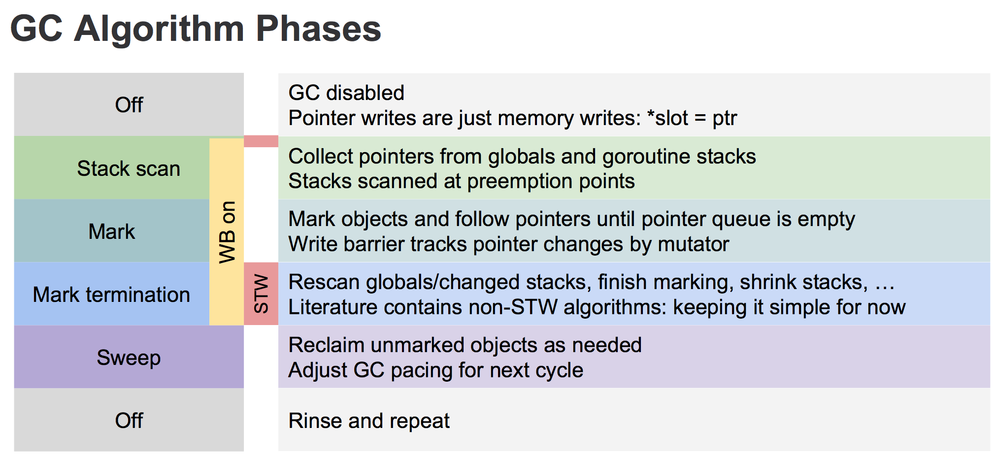

ref：	https://juejin.im/post/5d78b3276fb9a06b1829e691
			https://medium.com/a-journey-with-go/go-how-does-the-garbage-collector-mark-the-memory-72cfc12c6976
			https://golang.design/under-the-hood/zh-cn/part2runtime/ch08gc/
			https://golang.org/s/go15gcpacing
			https://docs.google.com/document/d/1un-Jn47yByHL7I0aVIP_uVCMxjdM5mpelJhiKlIqxkE		// stack scan, see also mgcstack.go

# 0. basic

GODEBUG=gctrace=1 ./x 输出每次GC的统计数据，见runtime/extern.go.

Currently, it is:
	gc # @#s #%: #+#+# ms clock, #+#/#/#+# ms cpu, #->#-># MB, # MB goal, # P
where the fields are as follows:
	gc #        the GC number, incremented at each GC
	@#s         time in seconds since program start
	#%          percentage of time spent in GC since program start
	#+...+#     wall-clock/CPU times for the phases of the GC
	#->#-># MB  heap size at GC start, at GC end, and live heap
	# MB goal   goal heap size
	# P         number of processors used

example:
```
➜  gc GODEBUG=gctrace=1 ./largeslice
gc 1 @0.008s 0%: 0.016+0.25+0.005 ms clock, 0.13+0/0.17/0.033+0.041 ms cpu, 256->256->256 MB, 257 MB goal, 8 P (forced)
gc 2 @0.010s 0%: 0.031+0.16+0.003 ms clock, 0.25+0/0.13/0.027+0.031 ms cpu, 256->256->256 MB, 512 MB goal, 8 P (forced)
gc 3 @0.012s 1%: 0.014+0.073+0.003 ms clock, 0.11+0/0.096/0.049+0.025 ms cpu, 256->256->0 MB, 512 MB goal, 8 P (forced)
x released
```


// GC related
```Go
var heapminimum uint64 = defaultHeapMinimum		// 4 << 20
var gcpercent int32
var gcphase uint32

// The compiler knows about this variable.
// If you change it, you must change builtin/runtime.go, too.
// If you change the first four bytes, you must also change the write
// barrier insertion code.
var writeBarrier struct {
	enabled bool    // compiler emits a check of this before calling write barrier
	pad     [3]byte // compiler uses 32-bit load for "enabled" field
	needed  bool    // whether we need a write barrier for current GC phase
	cgo     bool    // whether we need a write barrier for a cgo check
	alignme uint64  // guarantee alignment so that compiler can use a 32 or 64-bit load
}

// gcBlackenEnabled is 1 if mutator assists and background mark
// workers are allowed to blacken objects. This must only be set when
// gcphase == _GCmark.
var gcBlackenEnabled uint32

var gcController gcControllerState


```

# 1. go1.5引入三色标记，go1.8引入写屏障。

# 2. 三色标记
    - 黑色集合中确保没有任何指针指向白色集合
    - 白色集合中的对象允许有指针指向黑色集合    ->> 待GC的对象
    - 灰色集合可能会有指针指向白色集合里的对象

    GC开始时，
        - 所有对象标记为白色。
        - 遍历所有根对象并标记为灰色。
        - 遍历灰色对象，将引用到的白色对象标记为灰色，同时把遍历过的灰色对象标记为黑色。
        - 重复上述第三个步骤，直到没有对象为灰色
        - 此时白色对象就是不可达对象，可以GC掉
    
		强三色不变性（strong tri-color invariant）：黑色对象不会指向白色对象，只会指向灰色对象或者黑色对象。
		弱三色不变性（weak tri-color invariant）：即便黑色对象指向白色对象，那么从灰色对象出发，总存在一条可以找到该白色对象的路径。

    写屏障(write barrier)
        遍历灰色对象时灰色对象可能会改变，导致某些对象扫描不到被误认为白色垃圾而被GC。
        如: A(灰) -> B,C
            D(灰) -> E
            扫描完A后将A标记为黑，B、C标记为灰，扫描到D时有goroutine将D->E改成A->E,
            则E虽然还在被引用但会GC掉。
        
    go1.7以前，采用的是Dijkstra-style insertion write barrier，将被指向的对象变灰，
		这样新的对象创建或者黑色对象指向白色的时候，目标会变灰从而满足黑色不会指向白色，也就是强三色不变性。

		```
		writePointer(slot, ptr):
    		shade(ptr)	//将ptr标记为灰色
    		*slot = ptr //slot指向ptr
		```

		该写屏障只能shade堆上的内存引用，栈上实现写屏障有较大难度，因此需要STW来rescan一次。
		
		为了缩小STW时间，go1.8开始引入混合写屏障来去掉rescan，
		refer: https://github.com/golang/proposal/blob/master/design/17503-eliminate-rescan.md

		```
		writePointer(slot, ptr):
			shade(*slot)
			if current stack is grey:
				shade(ptr)
			*slot = ptr
		```


# 3. GC流程
		// see mgc.go
    - Sweep Termination: 对未清扫的span进行清扫, 只有上一轮的GC的清扫工作完成才可以开始新一轮的GC
			+ STW(Stop the world),使所有P进入safe-point。
			+ Sweep any unswept spans，清理尚未未清理的span，只有在这个GC周期被提前执行的时候才会存在未清理的span。
		
    - Mark: 扫描所有根对象, 和根对象可以到达的所有对象, 标记它们不被回收
			+ 将GC状态从_GCoff切换为_GCmark，启用write barrier以及mutator assists，并且将根标记对象入队。
					在所有P启用write barrier之前不会扫描任何对象(由STW保证)。
			+ Start the world。从这个时间点开始，GC由scheduler和assists启动的mark worker执行，写屏障会shade
					对指针有写入操作的被覆盖指针以及新的指针(见m_barrier.go)。新分配的对象会被直接标记为black。
			+ GC开始执行root mark jobs，包括扫描所有栈，shade全局变量以及堆外runtime数据中的堆指针。
					扫描栈会暂停一个goroutine，shade栈上的指针然后恢复goroutine。
			+ GC遍历(drain)灰色对象的队列，扫描所有灰色对象，将其标记为黑，并shade(变灰)其中的指针。
					(这些指针之后会加入到灰色队列)
			+ 鉴于GC会涉及到local caches，因此会使用一种分布式终止算法来判断root mark jobs和grey objects是否还存在(见gcMarkDone)，
					之后会进入mark termination状态。

    - Mark Termination: 完成标记工作, 重新扫描部分根对象(要求STW)
			+ Stop the world。
			+ 状态从_GCmark切换到_GCmarktermination，停止workers和assists。
			+ 执行一些扫尾处理比如flush mcache。

    - Sweep: 按标记结果清理span
			+ 把状态从_GCmarktermination切换到_GCoff，设置sweep状态，禁用write barrier。
			+ Start the world。自此开始新分配的对象标记为白色，并且必要情况下分配sweeps spans(清理后的span?)。
			+ GC开始在后台以及分配时进行并发清理(concurrent sweep)。

	0. 开始时所有对象都被标为白色(可被回收)
	1. STW，将所有栈及global变量标为灰色 (Stack scan)
	2. 从灰色对象开始并发标记所有可达对象，将可达对象标为灰色，当一个对象所有引用对象都被标为灰色后，该对象就被置为黑色。(Mark)
	3. 当所有对象都被标为黑色后，再进行一次STW，重新扫描栈和global未扫描过的对象。(Mark termination)
	4. 并发的清除所有白色对象。(Sweep)
	参考assets/GO-GC-Algorithm-Phases.png


# 3.1 GCphase transition

```Go
const (
	_GCoff             = iota // GC not running; sweeping in background, write barrier disabled
	_GCmark                   // GC marking roots and workbufs: allocate black, write barrier ENABLED
	_GCmarktermination        // GC mark termination: allocate black, P's help GC, write barrier ENABLED
)
```

gcStart: 						setGCPhase(_GCmark)
gcMarkTermination: 	setGCPhase(_GCmarktermination)	→	<g0>:gcMark		→		setGCPhase(_GCoff)

通常情况下处于GCoff阶段，


# 4. 调用链
runtime.main	→	 gcenable		→		go bgweep(c)/bgscavenge(c)	←		gcSweep() {ready(sweep.g, 0, true)}

gcBgMarkWorker/gcMarkTermination	→		gcDrain	→		markroot

gcAssistAlloc1	→		gcDrainN	→		markroot

gcAssistAlloc		→		gcMarkDone	→		gcMarkTermination
GC/forcegchelper/mallocgc	→		gcStart		→		go gcBgMarkWorker()	→		gcDrain + gcMarkDone	→	gcMarkTermination

# 4.1 forcegchelper

forcegchelper在runtime.init函数里调用，在for loop里等待sysmon到force GC的时候唤醒(通过切换forcegc.g到runnable状态)。

```Go
func init() {
	go forcegchelper()
}

func forcegchelper() {
	forcegc.g = getg()		// 设置forgc.g为当前g以便于sysmon定位到当前协程然后唤醒
	lockInit(&forcegc.lock, lockRankForcegc)
	for {
		...
		goparkunlock(&forcegc.lock, waitReasonForceGCIdle, traceEvGoBlock, 1)
		// this goroutine is explicitly resumed by sysmon
		gcStart(gcTrigger{kind: gcTriggerTime, now: nanotime()})
```


# 4.2 mark

```Go
func gcStart(trigger gcTrigger)
	- gcBgMarkStartWorkers()		
		// prepares background mark worker goroutines, these goroutines will not run until the mark phase. 创建gomaxprocs个worker
		- for gcBgMarkWorkerCount < gomaxprocs { go gcBgMarkWorker() ... }
			- gcBgMarkWorker()
				- gcDrain()
				- if work.nwait == work.nproc		→		gcMarkDone()
	- systemstack(gcResetMarkState)		// resets global state and the stack scan state of all Gs.

	- systemstack(stopTheWorldWithSema)
	- systemstack(func() { finishsweep_m() })
	- clearpools()
	- gcController.startCycle()		// resets the GC controller's state

		// Enter concurrent mark phase and enable write barriers.
	- setGCPhase(_GCmark)		// set GC phase to GCmark and enable writebarrier
	- gcBgMarkPrepare()		// sets up state for background marking, work.nproc/nwait=0xfff...
	- gcMarkRootPrepare()		
		// queues root scanning jobs(stacks, globals, and some miscellany), initializes scanning-related state
		// work.nBSSRoots/nDataRoots/nSpanRoots/nStackRoots/markrootJobs/...
	- gcMarkTinyAllocs()	
		// greys all active tiny alloc blocks
		// allp.p.mcache.tiny	→	runtime.greyobject
	- startTheWorldWithSema(trace.enabled)	// in g0 stack

```

# 4.3 mark termination

1). 当gomaxprocs个gcBgMarkWorker启动后，每个worker协程会进入休眠，等待gcController.findRunnableGCWorker唤醒。

```
gcBgMarkWorker():
	1. 把自己node加入到全局的gcBgMarkWorkerPool， node里附加了当前g。
	2. 切换到g0栈上执行gcDrain,此时worker本身的栈也会被扫描，
			这里会视当前p的gcMarkWorkerMode判断是dedicated、Fractional还是Idle模式传给gcDrain不同参数。
	3. 计算步骤2里标记所花费的时间，写到gcController.dedicatedMarkTime/fractionalMarkTime/idleMarkTime。
	4. 如果满足 atomic.Xadd(&work.nwait, +1) == work.nproc && !gcMarkWorkAvailable(nil)，
			则代表标记工作完成，执行gcMarkDone。
			- 关于work.nwait/nproc: 两者初始均为max_uint32(4294967295), bgWorker执行gcDrain前将work.nwait--,执行完后再++，
				因此理论上所有worker完成的话nwait等于nproc。
			- gcMarkWorkAvailable(p *p)：判断了三个要素
				- p.gcw		// 每个P的worker buffer cache，由write barrier填充，此处传入的p为nil因此不作判断
				- work.full		// 全局GC作业描述的full blocks workbuf,也就是是否还有global work
				- work.markrootNext < work.markrootJobs		// root标记工作是否完成

```

2). gcMarkDone：如果所有目标都被标记为黑色或白色(也就是没有灰色目标，并且将来也不会产生新的)，则把GC状态从GCMark切换到GCMarkTermination。
	1. semacquire(&work.markDoneSema)		// 确保同时只有一个线程在执行该函数
	2. !(gcphase == _GCmark && work.nwait == work.nproc && !gcMarkWorkAvailable(nil))	→	semrelease(&work.markDoneSema);return
			// 重新检查是否有标记任务残留
	3. semacquire(&worldsema)	// 后面的foreachP需要获取worldsema信号量
	4. systemstack(... foreachP→wbBufFlush1(_p_);_p_.gcw.dispose() )		
			// 在g0栈上把P的write barrier buffer flush到本地的p.gcw,然后再压入全局work.full,压入的同时会把p.gcw.flushedWork设为true
			// 然后把gcMarkDoneFlushed++
	5. 如果gcMarkDoneFlushed不为0代表有gcWork压入到了全局work.full，需要重新从2开始继续检查
	6. 否则证明没有global work/local work...，也就是说没有灰色对象以及没有对象需要屏障，可以切换到GCMarkTermination。
	7. systemstack(stopTheWorldWithSema)
	8. 由于write barrier在MarkTermination之前仍旧处于有效状态，因此GC程序自身可能产生一些gcWork
			此时需要在g0栈上再次执行wbBufFlush1，如果有write barrier被flush，需要返回到2重新检查。
	9. atomic.Store(&gcBlackenEnabled, 0)		// Disable assists and background workers
	10. gcWakeAllAssists()	// 唤醒work.assistQueue中的所有g，当STW结束时这些assistG会再度运行
	11. semrelease(&work.markDoneSema)
	12. schedEnableUser(true)		// enables the scheduling of user goroutines, 但不会停止已运行的goroutine，因此执行它之前应该先STW。
	13. nextTriggerRatio := gcController.endCycle()		// 计算触发下次GC的阈值
	14. gcMarkTermination(nextTriggerRatio)		// gcMarkTermination会start the world

3). gcMarkTermination
	1. setGCPhase(_GCmarktermination)		// 设置当前GC阶段为GCmarktermination，但WB依旧处于开启状态(mark|marktermination|cgo)
	2. systemstack(func() { gcMark(startTime) })	// gcMark检查了是否还有mark工作未完成，以及更新了memstats的一些数据
	3. systemstack(func() { setGCPhase(_GCoff); gcSweep(work.mode) })		// 假设debug.gccheckmark未设置
		- setGCPhase(_GCoff)		// 设置GC状态到GCoff,同时writeBarrier.enabled也变为0，也就是关闭写屏障
		- gcSweep(work.mode)		// 更新mheap的一些状态，然后启用sweep.g执行background sweep，`ready(sweep.g, 0, true)`，也就是唤醒执行bgsweep的协程。

4). bgsweep
	循环执行sweepone()	→	 goparkunlock(&sweep.lock, waitReasonGCSweepWait, traceEvGoBlock, 1)	→	等待gcMarkTermination下次唤醒	→	sweepone() →	...	

	sweepone核心逻辑：	// 每次sweepone只清理一个mspan
		- s = mheap_.nextSpanForSweep()	// 从central sweep buffer得到可sweep的mspan
		- s.sweep(false)	


# 4.x call chain

```
// chain1
gcMarkDone	→	gcMarkTermination	→ gcSweep(work.mode)	→		ready(sweep.g, 0, true)		→		sweepone()


```


# 5. 部分关键源码

# 5.1 

# 5.1 三色标记    //mgcmark.go::gcDrain()

```Go
func gcDrain(gcw *gcWork, flags gcDrainFlags) {
	if !writeBarrier.needed {
		throw("gcDrain phase incorrect")
	}

	gp := getg().m.curg         //获取当前g
	preemptible := flags&gcDrainUntilPreempt != 0   //是否可抢占,恒为false
	flushBgCredit := flags&gcDrainFlushBgCredit != 0
	idle := flags&gcDrainIdle != 0

	initScanWork := gcw.scanWork

	// checkWork is the scan work before performing the next
	// self-preempt check.
	checkWork := int64(1<<63 - 1)
	var check func() bool
	if flags&(gcDrainIdle|gcDrainFractional) != 0 {
		checkWork = initScanWork + drainCheckThreshold
		if idle {
			check = pollWork
		} else if flags&gcDrainFractional != 0 {
			check = pollFractionalWorkerExit
		}
	}

	// Drain root marking jobs.
	if work.markrootNext < work.markrootJobs {
		for !(preemptible && gp.preempt) {
			job := atomic.Xadd(&work.markrootNext, +1) - 1
			if job >= work.markrootJobs {
				break
			}
			markroot(gcw, job)
			if check != nil && check() {
				goto done
			}
		}
	}

	// Drain heap marking jobs.
	for !(preemptible && gp.preempt) {
		// Try to keep work available on the global queue. We used to
		// check if there were waiting workers, but it's better to
		// just keep work available than to make workers wait. In the
		// worst case, we'll do O(log(_WorkbufSize)) unnecessary
		// balances.
		if work.full == 0 {
			gcw.balance()
		}

		b := gcw.tryGetFast()
		if b == 0 {
			b = gcw.tryGet()
			if b == 0 {
				// Flush the write barrier
				// buffer; this may create
				// more work.
				wbBufFlush(nil, 0)
				b = gcw.tryGet()
			}
		}
		if b == 0 {
			// Unable to get work.
			break
		}
		scanobject(b, gcw)

		// Flush background scan work credit to the global
		// account if we've accumulated enough locally so
		// mutator assists can draw on it.
		if gcw.scanWork >= gcCreditSlack {
			atomic.Xaddint64(&gcController.scanWork, gcw.scanWork)
			if flushBgCredit {
				gcFlushBgCredit(gcw.scanWork - initScanWork)
				initScanWork = 0
			}
			checkWork -= gcw.scanWork
			gcw.scanWork = 0

			if checkWork <= 0 {
				checkWork += drainCheckThreshold
				if check != nil && check() {
					break
				}
			}
		}
	}

done:
	// Flush remaining scan work credit.
	if gcw.scanWork > 0 {
		atomic.Xaddint64(&gcController.scanWork, gcw.scanWork)
		if flushBgCredit {
			gcFlushBgCredit(gcw.scanWork - initScanWork)
		}
		gcw.scanWork = 0
	}
}
```

# 6 核心算法

# 6.1 gcController

```Go
// gcController implements the GC pacing controller that determines
// when to trigger concurrent garbage collection and how much marking
// work to do in mutator assists and background marking.
// gcController实现了GC pacing controller，以决定触发并发GC的时机和
// mutator协助标记/后台标记的工作量。

var gcController gcControllerState
```

gcController implements the GC pacing controller that determines
when to trigger concurrent garbage collection and how much marking
work to do in mutator assists and background marking.
// gcController实现了GC pacing controller，以决定触发并发GC的时机和
// mutator协助标记/后台标记的工作量。


